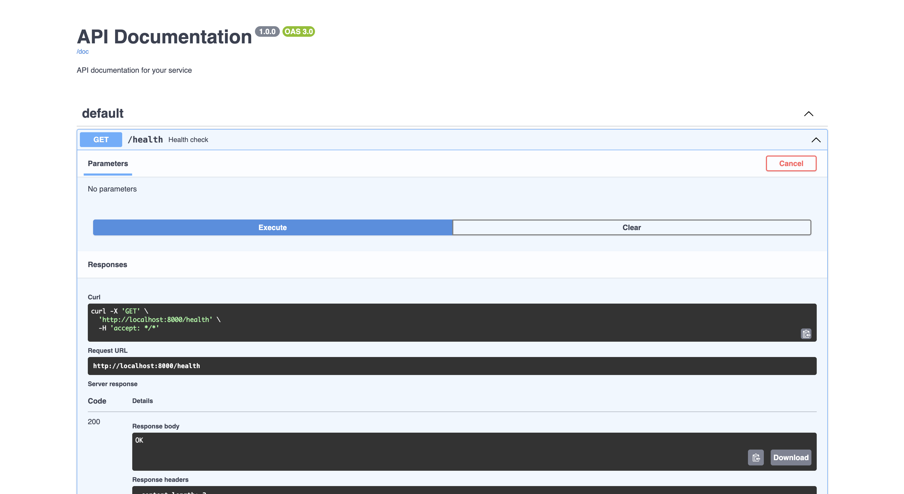

# Hono with Swagger UI for Cosmonic Control

This Wasm component is a tool for documenting and testing RESTful APIs, built on the [Hono HTTP framework](https://hono.dev/docs/) and the [Swagger UI](https://swagger.io/docs/open-source-tools/swagger-ui/usage/installation/) middleware. The component provides an interactive documentation interface based on a given OpenAPI specification. 

## Install local Kubernetes environment

For the best local Kubernetes development experience, we recommend installing `kind` with the following `kind-config.yaml` configuration:

```yaml
kind: Cluster
apiVersion: kind.x-k8s.io/v1alpha4
# One control plane node and three "workers."
nodes:
- role: control-plane
  extraPortMappings:
  - containerPort: 30950
    hostPort: 80
    protocol: TCP
```

This will help enable simple local ingress with Envoy.

Start the cluster:

```shell
kind create cluster --config=kind-config.yaml
```

## Install Cosmonic Control

:::warning[License key required]
You'll need a **trial license key** to follow these instructions. Sign up for Cosmonic Control's [free trial](/trial) to get a key.
:::

Deploy Cosmonic Control to Kubernetes with Helm:

```shell
helm install cosmonic-control oci://ghcr.io/cosmonic/cosmonic-control\
  --version 0.3.0\
  --namespace cosmonic-system\
  --create-namespace\
  --set envoy.service.type=NodePort\
  --set envoy.service.httpNodePort=30950\
  --set cosmonicLicenseKey="<insert license here>"
```

Deploy a HostGroup:

```shell
helm install hostgroup oci://ghcr.io/cosmonic/cosmonic-control-hostgroup --version 0.3.0 --namespace cosmonic-system
```

## Deploy with Cosmonic Control

Deploy this component to a Kubernetes cluster with Cosmonic Control using the shared HTTP trigger chart:

```shell
helm install hono-swagger-ui ../../charts/http-trigger -f values.http-trigger.yaml
```

You can also deploy the chart as an OCI artifact with a remote values file:

```shell
helm install hono-swagger-ui --version 0.1.2 oci://ghcr.io/cosmonic-labs/charts/http-trigger -f https://raw.githubusercontent.com/cosmonic-labs/control-demos/refs/heads/main/hono-swagger-ui/values.http-trigger.yaml
```

## Running on Kubernetes

Open browser to <hono-swagger-ui.localhost.cosmonic.sh/ui> to see the example.



## Cleaning up

```bash
helm uninstall hono-swagger-ui
```
## Contents

In addition to the standard elements of a TypeScript project, the directory includes the following files and directories:

- `values.http-trigger.yaml`: Helm values for the shared HTTP trigger chart
- `wit/`: Directory for WebAssembly Interface Type (WIT) packages that define interfaces

## Building locally

Before starting, ensure that you have the following installed:

- [`node` - NodeJS runtime](https://nodejs.org) (see `.nvmrc` for version)
- [`npm` - Node Package Manager (NPM)](https://github.com/npm/cli) manages packages for the NodeJS ecosystem
- [`wash` - Wasm Shell](https://github.com/wasmCloud/wash) for developing and building components

### Developing with `wash`

Clone the [cosmonic-labs/control-demos repository](https://github.com/cosmonic-labs/control-demos): 

```shell
git clone https://github.com/cosmonic-labs/control-demos.git
```

Change directory to `hono-swagger-ui`:

```shell
cd hono-swagger-ui
```

Start a development loop:

```shell
wash dev
```

or

```shell
npm run start
```

Navigate to [127.0.0.1:8000](http://127.0.0.1:8000).