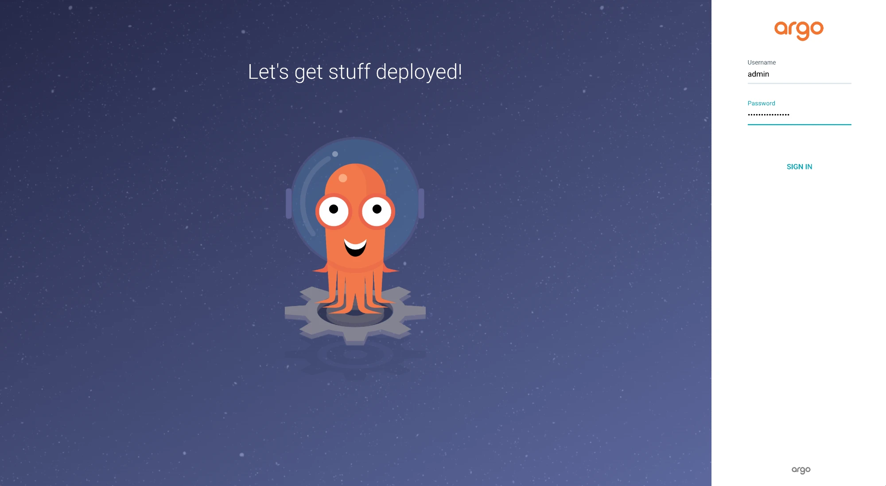

# Cosmonic Control with Argo CD

This repository includes an Argo CD Application CRD manifest that can be used to deploy [Cosmonic Control](https://cosmonic.com/docs/install-cosmonic-control), a [HostGroup](https://cosmonic.com/docs/custom-resources/#hostgroup), and the [Welcome Tour WebAssembly (Wasm) component](https://github.com/cosmonic-labs/control-demos/tree/main/welcome-tour) with Argo CD.

## Requirements

* A Kubernetes cluster with CoreDNS. (This guide was written using [`kind`](https://kind.sigs.k8s.io/) version 0.27.0, which includes CoreDNS by default.)
* [`kubectl`](https://kubernetes.io/releases/download/)

## Deploy Argo CD and Cosmonic Control

Install Argo CD using the [community-maintained Helm chart](https://argoproj.github.io/argo-helm/) and this `values.yaml` file:

```yaml
dex:
  enabled: false
notifications:
  enabled: false
applicationSet:
  enabled: false
server:
  insecure: true
```

This is a simple Argo CD installation that excludes components not needed for this guide, including `dex` and the notifications controller. The server runs with the `--insecure` flag in order to serve the Argo CD dashboard locally over HTTP without configuring certificates.

```shell
helm install argo-cd oci://ghcr.io/argoproj/argo-helm/argo-cd --version 8.1.3 --namespace argocd --create-namespace -f values.yaml
```

Port-forward the Argo CD server in order to access the dashboard. (Note: We're using our local port 3000 for the Argo CD dashboard in order to leave 8080 for the Cosmonic Control Console UI.)

```shell
kubectl port-forward service/argo-cd-argocd-server -n argocd 3000:443
```

Use `kubectl` to get the `admin` password for the dashboard, which is stored in a Kubernetes secret. (Note that certain shells like `zsh` may render a `%` at the end of the returned output.)

```shell
kubectl get secret argocd-initial-admin-secret -n argocd -o jsonpath="{.data.password}" | base64 -d
```

Navigate to [localhost:3000](localhost:3000) to access the Argo CD dashboard in your browser. Log in to the dashboard with the `admin` username and the returned password.



You should see the Argo CD dashboard without any running Applications.


Use the Argo Application CRD manifests in `control-proj.yaml` to define your deployments of Cosmonic Control, a Cosmonic Control HostGroup, and the Welcome Tour component.

```yaml
apiVersion: argoproj.io/v1alpha1
kind: Application
metadata:
  name: cosmonic-control
  namespace: argocd
  annotations:
    # ArgoCD will apply this manifest first.
    argocd.argoproj.io/sync-wave: "1"
spec:
  project: default
  source:
    chart: cosmonic-control
    repoURL: ghcr.io/cosmonic  # note: the oci:// syntax is not included.
    targetRevision: 0.2.0
    helm:
      valuesObject: 
        cosmonicLicenseKey: "<insert license here>"
  destination:
    name: "in-cluster"
    namespace: cosmonic-system
  syncPolicy:
    automated: {}
    syncOptions:
      - CreateNamespace=true
    retry:
      limit: -1
      backoff:
        duration: 30s
        factor: 2
        maxDuration: 5m
---
apiVersion: argoproj.io/v1alpha1
kind: Application
metadata:
  name: hostgroup
  namespace: argocd
  annotations:
    # ArgoCD will apply this manifest first.
    argocd.argoproj.io/sync-wave: "1"
spec:
  project: default
  source:
    chart: cosmonic-control-hostgroup
    repoURL: ghcr.io/cosmonic  # note: the oci:// syntax is not included.
    targetRevision: 0.2.0
    helm:
      valuesObject: 
        http:
          enabled: true
  destination:
    name: "in-cluster"
    namespace: cosmonic-system
  syncPolicy:
    automated: {}
    retry:
      limit: -1
      backoff:
        duration: 30s
        factor: 2
        maxDuration: 5m
---
apiVersion: argoproj.io/v1alpha1
kind: Application
metadata:
  name: welcome-tour
  namespace: argocd
  annotations:
    # ArgoCD will apply this manifest second.
    argocd.argoproj.io/sync-wave: "2"
spec:
  project: default
  source:
    chart: charts/welcome-tour
    repoURL: ghcr.io/cosmonic-labs  # note: the oci:// syntax is not included.
    targetRevision: 0.1.0
  destination:
    name: "in-cluster"
    namespace: welcome-app
  syncPolicy:
    automated: {}
    syncOptions:
      - CreateNamespace=true
    retry:
      limit: -1
      backoff:
        duration: 30s
        factor: 2
        maxDuration: 5m
```

Apply the manifest:

```shell
kubectl apply -f control-proj.yaml
```

The Applications will appear on the Argo CD dashboard. It may take a moment for the Applications to finish syncing.


You can click on an Application to view it in more detail. Try clicking on the welcome-tour application to view the resources defining the Wasm workload.


## Test the deployments

Port-forward to access the Cosmonic Control Console UI at [localhost:8080](localhost:8080):

```shell
kubectl -n cosmonic-system port-forward svc/console 8080:8080
```

Port-forward to access the Welcome Tour component at [localhost:9091](localhost:9091):

```shell
kubectl -n cosmonic-system port-forward svc/hostgroup-default 9091:9091
```

## Clean up

When you're finished:

```shell
kubectl delete -f control-proj.yaml
```
```shell
helm uninstall argo-cd -n argocd
```

If you're using `kind`:

```shell
kind delete cluster
```